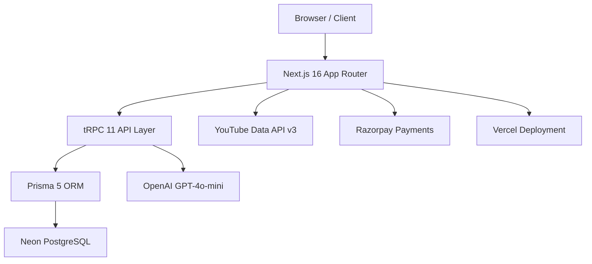
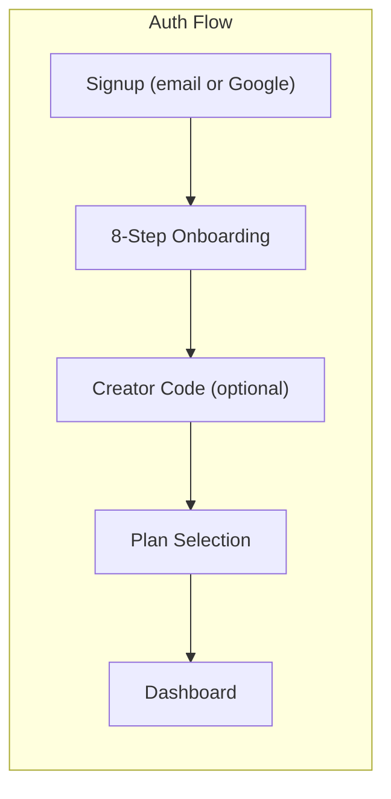
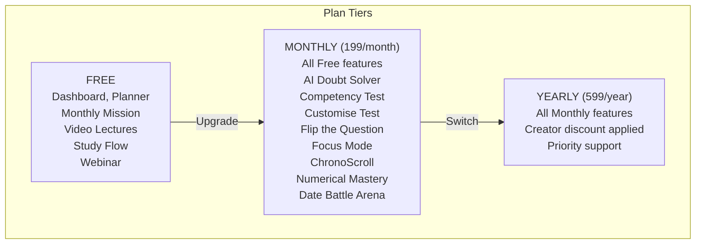
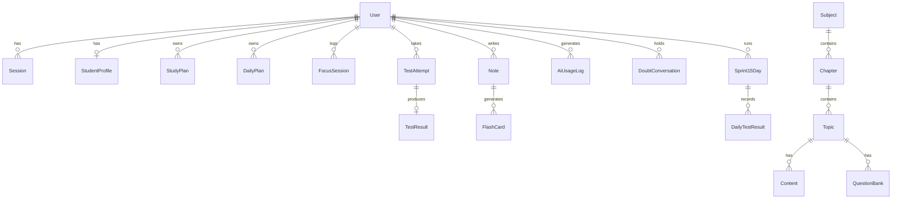
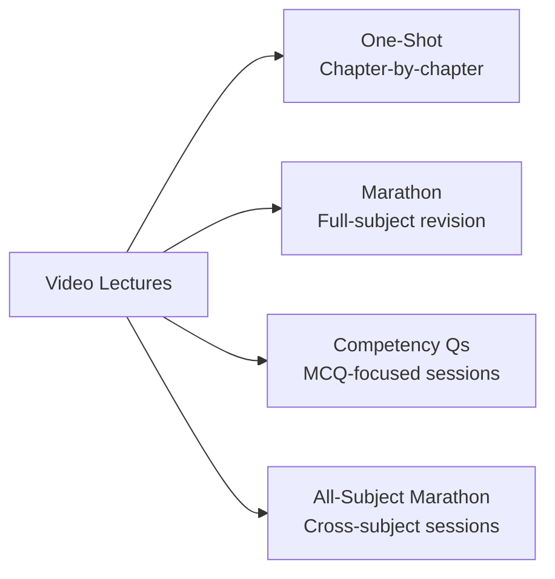

<div align="center">

<svg width="72" height="72" viewBox="0 0 72 72" fill="none" xmlns="http://www.w3.org/2000/svg">
  <circle cx="36" cy="36" r="35" stroke="#00D4FF" stroke-width="1.5" fill="none" opacity="0.3"/>
  <path d="M36 8L60 24L36 64L12 24L36 8Z" fill="none" stroke="#00D4FF" stroke-width="1.5"/>
  <path d="M36 8L60 24L36 44L12 24L36 8Z" fill="#00D4FF" fill-opacity="0.12"/>
  <path d="M12 24L36 44L60 24" stroke="#00D4FF" stroke-width="1" opacity="0.5"/>
</svg>

# Saviours AI

**CBSE Class 10 board exam preparation, rebuilt from the ground up**

[Live Platform](https://saviours.pro) &nbsp;|&nbsp; [Admin Panel](https://saviours.pro/admin)

<br/>


</div>

---

## What this is

Saviours AI is a full-stack education platform built specifically for students preparing for the CBSE Class 10 board exams. It covers nine subjects with a mix of AI-powered tools, structured study plans, gamified learning, and a full video lecture library. Everything runs under a single authentication layer with a tiered access model: free users get planning and community resources, paid users unlock the AI and practice engine.

The platform serves students, but it is also designed to be operated by the team behind it, through a custom admin panel that handles creators, user management, revenue tracking, and feature flags without touching the database directly.

---

## Table of Contents

- [Live Platform](#-live-platform)
- [Feature Map](#-feature-map)
- [Architecture](#-architecture)
- [Design System](#-design-system)
- [Database Schema](#-database-schema)
- [Authentication and Access Control](#-authentication-and-access-control)
- [Payments and Creator Affiliate System](#-payments-and-creator-affiliate-system)
- [API Surface](#-api-surface)
- [Data Layer](#-data-layer)
- [Admin Panel](#-admin-panel)
- [Feature Flags](#-feature-flags)
- [Environment Variables](#-environment-variables)
- [Commands](#-commands)
- [Deployment](#-deployment)

---

## Live Platform

**URL:** [https://saviours.pro](https://saviours.pro)

The production deployment runs on Vercel, connected to two separate Neon PostgreSQL databases: one for preview branch deployments and one for production. Static assets and fonts are served through the Next.js public directory. Analytics run through Vercel Analytics, embedded in the layout.

---

## Feature Map

### Free Tier

These routes are accessible to all authenticated users regardless of plan.

<details>
<summary>Dashboard</summary>

The main dashboard shows a stats strip with study plan metrics and Monthly Mission progress. Users can toggle between two modes: Smart Planner mode (derived from daily study plan data) and Monthly Mission mode (derived from localStorage task completion). The toggle state persists across sessions.

The dashboard also shows a dynamic plan badge, an upgrade button for free users, and payment warning banners when subscriptions are cancelled or expired.

</details>

<details>
<summary>Smart Planner</summary>

An AI-powered daily study schedule generator. The user specifies subjects, difficulty weights, and available study hours. The planner creates chapter-wise daily tasks, stores them as DailyPlan records in the database, and surfaces them on the dashboard stats strip. Plans can be marked complete, edited, or deleted. A timeline view shows the full plan across weeks.

</details>

<details>
<summary>Monthly Mission</summary>

A structured 11-month preparation roadmap from May through March, aligned with the CBSE exam cycle. Each month contains weekly plans. Each week breaks down into subject-specific tasks and add-on activities. Progress persists in localStorage under the key `saviours-monthly-mission-v2`. Week cards are collapsible, with Week 1 open by default. Each subject gets a colour-coded pill badge.

</details>

<details>
<summary>Video Lectures</summary>

A full lecture library with 9 subjects and three content types per subject:

- **One-Shot** -- chapter-by-chapter lectures covering each topic from scratch
- **Marathon** -- full-subject revision sessions for exam week
- **Competency Questions** -- MCQ-focused practice sessions

An additional "All-Subject Marathon" mode plays cross-subject revision sessions in sequence. The interface uses a playlist layout with a sticky player on the right and a scrollable chapter list on the left. The player loads on demand (click to play) to avoid loading dozens of iframes at once.

The library covers 9 subjects with dedicated content for Mathematics, Physics, Chemistry, Biology, History and Civics, Geography, English Language, English Literature, and Computer Applications. English Literature chapters open a "Coming Soon" state.

</details>

<details>
<summary>Study Flow</summary>

A structured chapter walkthrough with three steps per chapter: Watch, Revise, and Practice.

The Watch step uses the YouTube Data API to search for relevant videos for the chapter (query: `{chapter name} Class 10 CBSE`). Results appear as clickable thumbnail cards. The search query is editable so students can refine it. When a student's creator has a configured YouTube channel ID, that creator's videos are pinned to the top of results with a "Recommended by {creator}" badge.

The Revise step shows a chapter summary and key concepts. The Practice step presents 5 to 10 questions with a reveal-answer interaction. Progress is saved to localStorage per chapter and subject.

The old static Watch step (with a hardcoded YouTube embed) is still accessible by setting `youtubeDiscovery: false` in the feature flags file.

</details>

<details>
<summary>Live Webinar</summary>

A Calendly-integrated page promoting free webinar sessions hosted by the Saviours AI team. Shows session details, topic coverage, host card, and a sticky CTA that opens the Calendly booking link. Free for all users.

</details>

<details>
<summary>Subjects Browser</summary>

A subject selection page listing all nine CBSE subjects. Each subject links to a chapter list, which links to the chapter detail page used by the Study Flow.

</details>

<details>
<summary>Guess Papers</summary>

Subject-wise guess papers available as PDF downloads.

</details>

### Paid Tier (Monthly / Yearly)

<details>
<summary>AI Doubt Solver</summary>

A chat interface powered by GPT-4o-mini with CBSE-specific system prompting. Supports image uploads (for handwritten problems) and PDF uploads. Maintains conversation history per session. Responses are streamed. Free users see a daily query limit of 3.

</details>

<details>
<summary>Competency Test</summary>

A timed MCQ test system built on previous year question banks covering Physics, Chemistry, Biology, Mathematics, and Computer Applications. Each subject has curated questions from 20 years of CBSE papers. Tests run with a countdown timer. Results show accuracy, time efficiency, strong and weak chapters, and mistake patterns.

</details>

<details>
<summary>Customise Test</summary>

On-demand test generation using GPT-4o-mini. Students pick a subject, select chapters, choose difficulty, and set the number of questions. The AI generates unique MCQ questions for each session. Results are graded instantly with explanations per question.

</details>

<details>
<summary>Flip the Question</summary>

A reverse-engineering challenge mode. Instead of answering a question, students are given an answer and must reconstruct the question. GPT-4o-mini evaluates the reconstructed question for accuracy and concept coverage. Tracks streaks and personal bests.

</details>

<details>
<summary>Focus Mode</summary>

A distraction-free study timer with three modes: Pomodoro (configurable work and break blocks), Deep Focus (long uninterrupted blocks), and Light Focus (shorter sessions with more frequent breaks). Sessions are logged to the database with subject, task type, quality rating, and completion status. The dashboard shows recent focus sessions.

</details>

<details>
<summary>ChronoScroll</summary>

An interactive History and Civics timeline. Students scroll through historical events in chronological order. Each event has a Quick Recall card that tests recognition with a flip interaction. Designed for CBSE History chapters that require date and event memorisation.

</details>

<details>
<summary>Numerical Mastery</summary>

A Physics numericals practice tool with a three-level navigation: chapters, topics, and individual problems. Each problem card shows the formula, a worked example, and a reveal-able PYQ from CBSE papers. Students can mark topics as mastered. A floating recap button summarises mastered topics for the session.

</details>

<details>
<summary>Date Battle Arena</summary>

A gamified History and Civics date-learning game. Students face a countdown timer and must correctly match historical events to dates. Combo streaks multiply scores. The game tracks rank tiers and personal bests. Leaderboard data is maintained per session.

</details>

---

## Architecture







### Request Flow

Every page fetch goes through Next.js App Router. Server components read data directly from Prisma via the `getCurrentUser()` helper. Client components call tRPC procedures via React Query, which handles caching, invalidation, and loading states. The tRPC router lives at `/api/trpc/[trpc]` and runs on the Edge-compatible Node.js runtime.

Authentication is JWT-based using `jose`. Tokens are stored in HttpOnly cookies and verified in both the middleware (for route guarding) and in the `createTRPCContext` function (for per-request auth). The middleware runs before every request under `/dashboard` and `/onboarding`.

### Directory Structure

```
src/
  app/
    (auth)/         login, signup, onboarding
    admin/          overview, users, revenue, features, creators
    dashboard/      20+ sub-routes (see Feature Map)
    api/            tRPC handler, auth routes, payment routes
    globals.css     design system tokens, font faces, component classes
  components/
    layout/         dashboard sidebar, admin shell
    onboarding/     8-step onboarding flow
    ui/             pricing cards, testimonials, effects, shared primitives
    UpgradePrompt   in-dashboard plan upgrade modal with discount display
    RazorpayButton  handles both order flow (yearly) and subscription flow (monthly)
  data/             static data for all features (question banks, video links, etc.)
  hooks/            useResponsive, custom tRPC hooks
  lib/              auth, planAccess, tier-config, featureFlags, AI utilities
  server/
    trpc.ts         context, middleware, procedure factories
    routers/        12 tRPC routers
  middleware.ts     route guards, subscription checks, redirects
prisma/
  schema.prisma     30+ models
  seed.ts           subjects, chapters, creators
  migrations/       production migration history
```

---

## Design System

### Colour Palette

| Token | Value | Usage |
|-------|-------|-------|
| `--bg-base` | `#0D0D1A` | Page background, deepest layer |
| `--bg-surface` | `#13131F` | Cards, sidebars, modals |
| `--bg-elevated` | `#1A1A2E` | Dropdowns, tooltips, popovers |
| `--bg-border` | `#252538` | Dividers, input borders, separators |
| `--bg-border-light` | `#353552` | Lighter strokes, secondary outlines |
| `--text-primary` | `#F5F0E8` | Main readable text, headings |
| `--text-secondary` | `#B0AABA` | Descriptions, supporting text |
| `--text-muted` | `#6B6B80` | Labels, captions, inactive states |
| `--text-disabled` | `#3D3D50` | Disabled controls |
| `--accent-gold` | `#00D4FF` | Primary accent (electric cyan), CTAs, active states |
| `--accent-gold-dim` | `#00A3CC` | Hover and pressed states for accent |
| `--accent-gold-glow` | `rgba(0,212,255,0.15)` | Glow fills, active backgrounds |
| `--accent-gold-border` | `rgba(0,212,255,0.35)` | Accent-coloured borders |
| `--status-green` | `#3ECF8E` | Success, completed, valid |
| `--status-red` | `#F87171` | Error, warning, danger |
| `--status-blue` | `#60A5FA` | Info, links |
| `--status-orange` | `#FB923C` | Caution, warnings |

### Typography

The type system uses two custom font families loaded via `@font-face`, with system and Google Fonts as fallbacks.

| Variable | Primary Font | Fallback Chain | Used For |
|----------|-------------|----------------|----------|
| `--font-display` | SF Pro Display | Inter, Helvetica Neue | Large headings, page titles, number displays |
| `--font-tagline` | ScotchDisplay | Georgia, Times New Roman | Italic taglines, cinematic captions, onboarding text |
| `--font-body` | SF Pro Text | DM Sans, Inter, Helvetica Neue | All body copy, labels, form fields |
| `--font-mono` | SF Mono | Courier New | Code snippets, monospace values |

**ScotchDisplay** is a custom serif face loaded from `/public/fonts/ScotchDisplay-Regular.woff2`. It is the defining typographic character of the brand, used for all italic taglines and cinematic text throughout the onboarding and landing sequences.

**Type scale:**

```
--text-xs:   11px    labels, captions, badge text
--text-sm:   13px    secondary body, sidebar items
--text-base: 15px    default body text
--text-md:   17px    prominent body, form inputs
--text-lg:   20px    section subheadings
--text-xl:   24px    card headings
--text-2xl:  32px    page headings
--text-3xl:  44px    hero subheadings
--text-4xl:  60px    large display numbers
--text-hero: 80px    cinematic hero text
```

### Component Classes

All styling in this project uses inline CSS with design system tokens. No Tailwind utility classes appear in component files. The following global classes exist in `globals.css` for shared patterns:

| Class | Purpose |
|-------|---------|
| `.sa-input` | Text input fields with autofill overrides, focus ring, and placeholder colour |
| `.btn-gold` | Primary CTA button with liquid glass effect and cyan gradient |
| `.btn-ghost` | Secondary transparent button with subtle border |
| `.sa-card` | Surface card with border, border-radius, and hover lift animation |
| `.dashboard-card` | Variant card used across dashboard panels |
| `.chip-gold` | Inline tag pill with accent colour background |
| `.chip-green` | Success state inline tag |
| `.skeleton` | Shimmer loading placeholder |
| `.page-enter` | Fade-up entrance animation applied on route transitions |

### Visual Effects

- **Glassmorphism** -- heavily used on modals, the sidebar, and onboarding overlays using `backdrop-filter: blur()` with semi-transparent backgrounds
- **Glow borders** -- input focus states and active nav items use `box-shadow` with the accent colour at low opacity
- **Liquid glass buttons** -- the primary CTA class uses a layered gradient with a subtle shine animation
- **ScotchDisplay italic** -- used on onboarding screens for a cinematic serif contrast against the body sans-serif
- **WebGL shader canvas** -- the pricing screen uses a custom vertex and fragment shader for an animated flowing background, rendered in a `<canvas>` element
- **Vapour text effect** -- the final onboarding step uses a custom particle disintegration animation for the welcome message
- **Video backgrounds** -- onboarding screens use a desaturated, darkened video loop behind content

### Subject Colour System

Each subject in the Video Lectures section and Study Flow carries a dedicated accent colour that propagates through tabs, borders, progress bars, and active states:

| Subject | Colour |
|---------|--------|
| Mathematics | `#3B82F6` (blue) |
| Physics | `#F59E0B` (amber) |
| Chemistry | `#00D4FF` (cyan) |
| Biology | `#22c55e` (green) |
| History and Civics | `#FB923C` (orange) |
| Geography | `#14B8A6` (teal) |
| English Language | `#A78BFA` (violet) |
| English Literature | `#EC4899` (pink) |
| Computer Applications | `#F97316` (orange-red) |

---

## Database Schema

### Model Groups



### Key Models

| Group | Models |
|-------|--------|
| Auth and Users | `User`, `Session`, `AuditLog`, `Creator` |
| Profiles | `StudentProfile`, `TeacherProfile`, `LearningPattern`, `TestPerformance` |
| Curriculum | `Subject`, `Chapter`, `Topic`, `Content`, `RevisionChecklist` |
| Planning | `StudyPlan`, `DailyPlan`, `PlanAdjustment` |
| Revision | `RevisionSchedule`, `RevisionPlan` |
| Notes | `Note`, `FlashCard`, `RevisionSheet` |
| Testing | `QuestionBank`, `Test`, `TestAttempt`, `TestResult` |
| Focus | `FocusSession` |
| AI Tracking | `AiUsageLog`, `DoubtConversation` |
| Sprint System | `Sprint15Day`, `Sprint15TestSubmission`, `DailyTestResult`, `ChapterPerformance` |

### Enums

```
PlanType:              FREE | MONTHLY | YEARLY
SubscriptionStatus:    ACTIVE | EXPIRED | CANCELLED
UserRole:              STUDENT | TEACHER | ADMIN
FocusModeType:         POMODORO | DEEP_FOCUS | LIGHT_FOCUS
FocusQuality:          GOOD | OKAY | POOR
QuestionType:          MCQ | SHORT_ANSWER | LONG_ANSWER | TRUE_FALSE
RevisionPlanType:      THIRTY_DAY | FIFTEEN_DAY | SEVEN_DAY
Sprint15Status:        DIAGNOSTIC_PENDING | ACTIVE | COMPLETED | ABANDONED
```

---

## Authentication and Access Control

### Auth Stack

- **JWT tokens** via `jose`, stored in HttpOnly cookies
- **Custom credential auth** (bcryptjs password hashing)
- **Google OAuth** -- server-side flow through `/api/auth/google`, CSRF state token in a separate `oauth-state` HttpOnly cookie, callback at `/api/auth/google/callback`
- **Demo account** -- a shared demo user accessible from the login page without credentials
- **Session refresh** -- tokens are reissued on plan changes, name updates, and post-payment verification

### Onboarding Flow

New users go through an 8-step cinematic onboarding sequence before reaching the dashboard:

```
Step 1  Cinematic splash screen (video background, tap to continue)
Step 2  Apple-style greeting sequence with contextual messages
Step 3  Social proof cards (testimonials)
Step 4  Name and phone number collection
Step 5  Creator code entry (optional, unlocks yearly discount)
Step 6  Plan selection (Free / Monthly / Yearly)
Step 7  Loading screen with setup progress indicators
Step 8  Vapour text welcome animation, then redirect to dashboard
```

### Route Guards

The middleware at `src/middleware.ts` runs on every request to `/dashboard/*` and `/onboarding`.

| Condition | Behaviour |
|-----------|-----------|
| No auth token | Redirect to `/login` |
| Valid token, onboarding incomplete | Redirect to `/onboarding` |
| Valid token, onboarding complete | Allow through to dashboard |
| Grandfathered user (created before 2026-01-29) | Always has full access regardless of plan |
| Free user accessing locked route | UpgradePrompt modal shown via sidebar navigation handler |

### Tier Access

```
Free:    Dashboard, Smart Planner, Monthly Mission, Video Lectures,
         Study Flow, Subjects, Guess Papers, Webinar, Live Webinar

Paid:    Everything above, plus:
         AI Doubt Solver, Competency Test, Customise Test,
         Flip the Question, Focus Mode, ChronoScroll,
         Numerical Mastery, Date Battle Arena
```

---

## Payments and Creator Affiliate System

### Plan Pricing

| Plan | Price | Type | Razorpay Flow |
|------|-------|------|---------------|
| Free | No charge | | |
| Monthly | 199/month | Recurring subscription | `subscription_id` via `/api/create-subscription` |
| Yearly | 599/year | One-time order | `order_id` via `/api/create-order` |

### Creator Affiliate System

Creators (YouTubers, EdTech channels) receive a unique alphanumeric code. Students enter this code during onboarding step 5. The code is stored permanently on the user record. When the student reaches the pricing screen, the yearly plan shows the discounted price with a strikethrough of the original.

Creator discounts apply **to yearly plans only**. Monthly pricing stays fixed.

The discount is calculated and applied entirely server-side in `create-order`:

```
discounted_amount = base_price * (1 - discount_percentage / 100)
```

The Razorpay order is created with this amount, so the checkout window shows the correct final price.

**Creator model fields:**

| Field | Type | Purpose |
|-------|------|---------|
| `creatorCode` | String, unique | The code students enter |
| `creatorName` | String | Display name shown to students |
| `discountPercentage` | Int (1-100) | Applied to yearly plan at checkout |
| `channelId` | String, nullable | YouTube channel ID for study flow video boosting |

When a creator has a configured `channelId`, their videos appear pinned at the top of YouTube search results in the Study Flow Watch step.

### Subscription Lifecycle (Webhook)

The Razorpay webhook at `/api/razorpay/webhook` handles the full subscription lifecycle:

| Event | Action |
|-------|--------|
| `subscription.charged` | Set `isPaid = true`, `planType = MONTHLY`, `subscriptionStatus = ACTIVE` |
| `subscription.cancelled` | Set `subscriptionStatus = CANCELLED`, show warning banner |
| `subscription.halted` | Set `subscriptionStatus = EXPIRED` |
| `subscription.completed` | Run lazy demotion to FREE after final cycle |

### Domin8 Pro Bundle

A secret activation code system starting with the letter `W`. Students with a Domin8 Pro bundle code activate via `/api/auth/activate-domin8`, which grants Yearly-tier access permanently.

---

## API Surface

### tRPC Routers

| Router | Key Procedures |
|--------|---------------|
| `auth` | `signup`, `login`, `logout`, `getSession`, `getProfile` |
| `dashboard` | `getProfile`, `getStudyStats` |
| `planner` | `generateSmartPlan`, `getMyPlans`, `getTodayPlans`, `togglePlanComplete`, `clearAllPlans` |
| `content` | `getSubjects`, `getChaptersBySubject`, `getTopicsByChapter`, `getNotes`, `createNote`, `deleteNote` |
| `ai` | `askDoubt`, `generatePlan`, `generateQuestions`, `generateFlashcards`, `summarize`, `getUsageStats` |
| `test` | `createTest`, `saveAnswer`, `submitTest`, `getHistory` |
| `profile` | `getStats`, `updateProfile` |
| `strategy` | `generate` |
| `focus` | `logSession`, `getRecentSessions` |
| `precision` | `saveResult`, `getHistory` |
| `flip` | `generateChallenge`, `getHint`, `evaluateSubmission`, `getStats` |
| `creator` | `getAll`, `getMyDiscount`, `saveCreatorCode` |

### REST API Routes

| Route | Method | Purpose |
|-------|--------|---------|
| `/api/auth/google` | GET | Initiates Google OAuth, sets CSRF state cookie |
| `/api/auth/google/callback` | GET | Handles OAuth callback, creates session |
| `/api/auth/save-profile` | POST | Saves name and phone from onboarding step 4 |
| `/api/auth/save-creator` | POST/GET | Saves creator code, lists all creators |
| `/api/auth/complete-onboarding` | POST | Marks `onboardingComplete = true` |
| `/api/auth/set-plan` | POST | Sets plan type (used for free plan selection) |
| `/api/auth/activate-domin8` | POST | Activates Domin8 Pro bundle code |
| `/api/auth/demo` | POST | Creates/logs in demo session |
| `/api/create-order` | POST | Creates Razorpay order with server-side discount calculation |
| `/api/create-subscription` | POST | Creates Razorpay subscription for monthly plan |
| `/api/razorpay/webhook` | POST | Handles subscription lifecycle events |
| `/api/youtube-search` | GET | Server-side YouTube Data API v3 search with creator boosting |
| `/api/admin/login` | POST | Admin JWT authentication |
| `/api/admin/creators` | GET/POST/PUT/DELETE | Full CRUD for creator management |

---

## Data Layer

### Static Data Files

The `src/data/` directory contains all static content used across the platform. These files are TypeScript modules and are imported at build time, not fetched from the database at runtime.

| File | Contents |
|------|----------|
| `video-lectures.ts` | YouTube video IDs for 9 subjects, organised by category (oneshot / marathon / competency) and cross-subject marathon sessions |
| `monthly-mission.ts` | 11-month weekly task plans (May through March) with subject-tagged tasks and add-on activities per week |
| `studyFlowData.ts` | Chapter structure for study flow: watch video URL, revision summary, and practice questions per chapter |
| `numerical-mastery-data.ts` | Physics numericals with formula, worked example, and PYQ source per problem |
| `battle-config.ts` | Date Battle Arena game configuration: historical events, dates, difficulty tiers |
| `chrono-config.ts` | ChronoScroll timeline events with dates, context, and CBSE chapter mapping |
| `precision-*.ts` | PYQ-based MCQ banks for Physics, Chemistry, Biology, Mathematics, and Computer Applications |
| `tyq-*.ts` | Question banks for all 9 subjects used in the Competency Test and TYQ features |
| `lnb-mock-data.ts` | Last Night Before: numericals, formulas, and definitions for panic revision |

### Video Lecture Categories



---

## Admin Panel

The admin panel at `/admin` is a separate authenticated interface protected by its own JWT (signed with a `-admin-panel` suffixed secret). It does not use the regular user auth system.

**Login credentials** are defined directly in `/api/admin/login/route.ts`. No database lookup is performed.

### Admin Sections

| Section | URL | Purpose |
|---------|-----|---------|
| Overview | `/admin` | Platform metrics, recent signups, revenue summary |
| Users | `/admin/users` | Search users, change plan types, view subscription status |
| Revenue | `/admin/revenue` | Payment charts, MRR, plan distribution |
| Features | `/admin/features` | Toggle feature flags from the UI |
| Creators | `/admin/creators` | Full CRUD for creator affiliate codes |

### Creator Management

Admins can add a new creator by entering:

- Creator or channel name (display text shown to students)
- Creator code (alphanumeric, any case, no spaces)
- Discount percentage (1 to 100, applied to yearly plan only)
- YouTube channel ID (optional, used to boost that creator's videos in study flow search results)

The form shows a live price preview as the discount percentage is typed (for example, entering 30 shows "Monthly: 199 -- Yearly: 599 - 420"). The code is locked after creation to prevent breaking existing student referrals.

---

## Feature Flags

Feature visibility is controlled through two synchronised files: `src/lib/featureFlags.ts` (runtime checks in components) and `src/config/feature-flags.ts` (build-time checks). Both must be updated together when toggling a flag.

| Flag | Status | Controls |
|------|--------|---------|
| `studyFlow` | Live | Study Flow section |
| `videoLectures` | Live | Video Lectures library |
| `webinar` | Live | Live Webinar page |
| `aiDoubtSolver` | Live | AI Doubt Solver (paid) |
| `smartPlanner` | Live | Smart Planner |
| `competencyTest` | Live | Competency Test (paid) |
| `customiseTest` | Live | Customise Test (paid) |
| `flipTheQuestion` | Live | Flip the Question (paid) |
| `focusMode` | Live | Focus Mode (paid) |
| `numericalMastery` | Live | Numerical Mastery (paid) |
| `chronoScroll` | Live | ChronoScroll (paid) |
| `dateBattleArena` | Live | Date Battle Arena (paid) |
| `youtubeDiscovery` | Live | YouTube search in Study Flow Watch step |
| `todoList` | Live | Monthly Mission |
| `guessPapers` | Hidden | Guess Papers |
| `strategyAI` | Hidden | Exam Strategy Builder |
| `lastNightBefore` | Hidden | Last Night Before |
| `notesFlashcards` | Hidden | Smart Notes and Flashcards |

---

## Environment Variables

```env
# Database
DATABASE_URL                    Neon PostgreSQL connection string (production)

# Auth
JWT_SECRET                      Secret for user JWT signing
NEXT_PUBLIC_BASE_URL            Canonical URL (https://saviours.pro)

# OAuth
GOOGLE_CLIENT_ID                Google OAuth 2.0 client ID
GOOGLE_CLIENT_SECRET            Google OAuth 2.0 client secret

# AI
OPENAI_API_KEY                  OpenAI API key (GPT-4o-mini)
YOUTUBE_API_KEY                 YouTube Data API v3 key (server-side only)

# Payments
NEXT_PUBLIC_RAZORPAY_KEY_ID     Razorpay publishable key (frontend)
RAZORPAY_KEY_SECRET             Razorpay secret key (server-side only)
RAZORPAY_MONTHLY_PLAN_ID        Razorpay plan ID for monthly subscription (199/month)
RAZORPAY_MONTHLY_TOTAL_COUNT    Number of billing cycles (default: 11)
RAZORPAY_WEBHOOK_SECRET         Webhook signature verification secret

# Creator discounts (optional, for discounted monthly plans)
RAZORPAY_MONTHLY_PLAN_ID_BL2047    Discounted plan for Beast Learners
RAZORPAY_MONTHLY_PLAN_ID_CK2047    Discounted plan for Toppers Clan
```

---

## Commands

```bash
# Development
npm run dev                   Start Next.js dev server on localhost:3000

# Build
npm run build                 Run prisma generate then next build

# Database
npx prisma db push            Push schema to database (preview env)
npx prisma migrate deploy     Apply migrations (production)
npx prisma studio             Open database GUI
npx tsx prisma/seed.ts        Seed subjects, chapters, and creators

# Type checking
npx tsc --noEmit              Run TypeScript compiler check without emitting
```

---

## Deployment

**Platform:** Vercel

**Databases:**
- Preview branches connect to a dedicated Neon preview database
- Production connects to a separate Neon production database

**Build command:** `prisma generate && next build`

**Environment separation:**
- Preview env variables are set separately from production in Vercel
- The `DATABASE_URL` environment variable determines which Neon database is used

**Webhook endpoint:** `https://saviours.pro/api/razorpay/webhook` is registered in the Razorpay dashboard for all subscription events. This endpoint must not be modified without updating the Razorpay webhook secret and re-registering.

**Google OAuth redirect URIs** registered in Google Cloud Console:
- `https://saviours.pro/api/auth/google/callback`
- `http://localhost:3000/api/auth/google/callback` (for local development)

---

## Star History

<a href="https://www.star-history.com/?repos=harshitcodes1308%2Fsavioursai2027&type=date&legend=top-left">
 <picture>
   <source media="(prefers-color-scheme: dark)" srcset="https://api.star-history.com/chart?repos=harshitcodes1308/savioursai2027&type=date&theme=dark&legend=top-left" />
   <source media="(prefers-color-scheme: light)" srcset="https://api.star-history.com/chart?repos=harshitcodes1308/savioursai2027&type=date&legend=top-left" />
   
 </picture>
</a>

---

<div align="center">

<svg width="32" height="32" viewBox="0 0 48 48" fill="none" xmlns="http://www.w3.org/2000/svg">
  <path d="M24 4L44 18L24 44L4 18L24 4Z" fill="none" stroke="#00D4FF" stroke-width="1.5"/>
  <path d="M24 4L44 18L24 32L4 18L24 4Z" fill="#00D4FF" fill-opacity="0.12"/>
  <path d="M4 18L24 32L44 18" stroke="#00D4FF" stroke-width="1" opacity="0.5"/>
</svg>

Private. All rights reserved. Saviours AI 2026.

[https://saviours.pro](https://saviours.pro)

</div>
